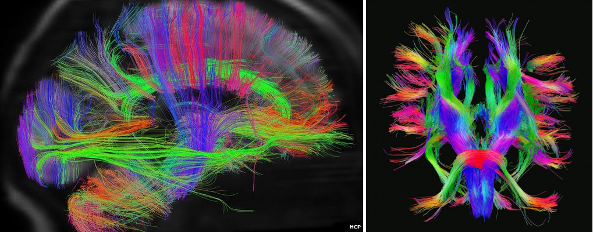
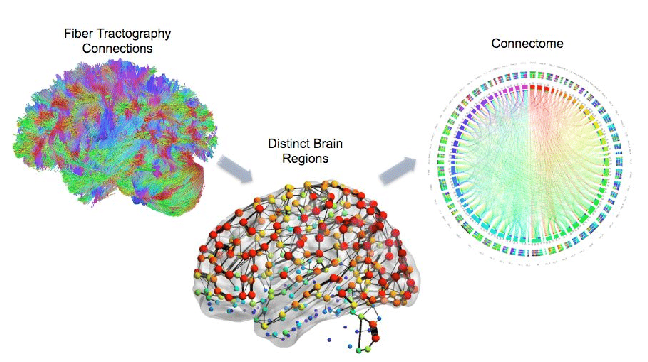
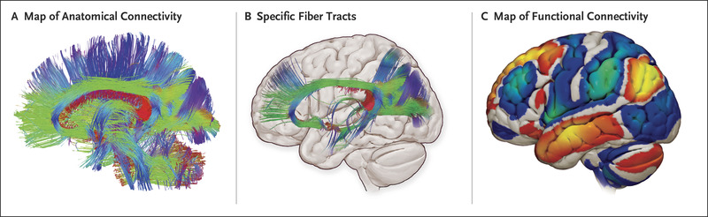

What makes us different from other people?
Why do the people of this planet have diverse talents and unique capabilities?
How do the tiny neurons in the brain coordinate all the activities of our body?
Well, biologically the answer lies in the interconnections of 90 billion neurons by 150 trillion 
synapses in the human brain. Rightfully unraveling the complexities of the human brain has been one of the 
biggest challenges since the emergence of neuroscience. Not only does neuroscience facilitate the understanding 
of brain functions and control, but it also gives us more insight into the various psychological disorders and 
brain diseases such as schizophrenia, autism, and Alzheimer’s.

The Human Connectome Project (HCP) was launched in 2009 in two research institutions, aiming to develop 
a whole network map (connectome) of the neural pathways that are key to brain function. It was sponsored by 
16 components of the National Institute of Health (NIH) as an attempt to address the Grand Challenges of the 
NIH's Blueprint for Neuroscience Research.

It started with the acquisition and analysis of nervous circuitry and connectivity in the 
brain through non-invasive imaging techniques such as structural MRI, task-activated functional MRI Diffusion 
MRI and Resting-state MRI. Dynamic teams of experts in neurobiology and neuroinformatics from the Washington 
University and the University of Minnesota led the project. Together with the use of Magnetoencephalography (MEG) 
for neuroimaging, a team also developed a special scanner for diffusion imaging.

In short, the goal is to fully understand the functions of different areas of the brain and hence use neuroanatomically
accurate maps of brain areas for diagnosis and analytics. These are now used in top clinics for analyzing and comparing 
human behavior. The spin-off factor of this project has been the technological techniques that were used to maximize the
resolution of imaging data, and minimize noise blurring and distortions in the variety of data collected. HCP has
mainly focused on healthy brains across the human lifespan of younger adults and now they are studying older 
individuals using the same methods. Through HCP neuroimaging and psychological data , individual differences 
in brain connectivity can be determined and used to predict a person's behavior. This leads to deeper insights 
about the neurobiological basis of variations in human behavior, health and disease and therefore allows more 
scope for personalized treatment and diagnosis.

The success of HCP has opened the doors for many more projects that may prove vital to our understanding of the 
human brain and the future of human connectomics. And finally, the cherry on top is that the NIH mandated the free 
sharing of the data collected to the neuroscience community to encourage more prospects in research.

