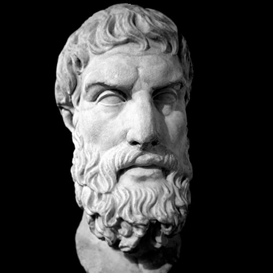
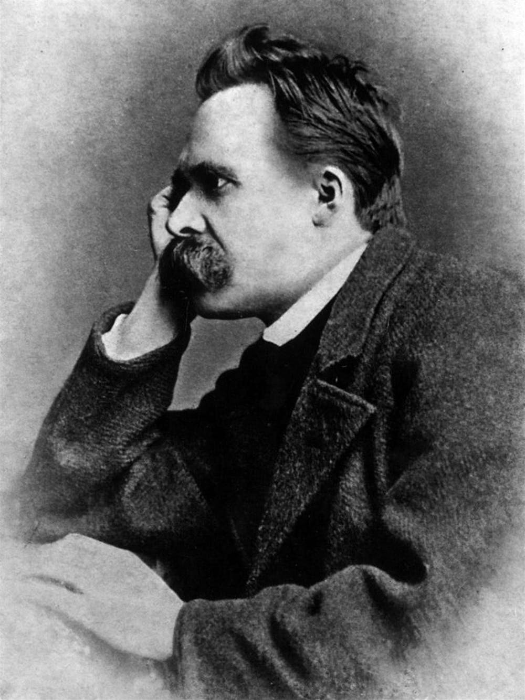
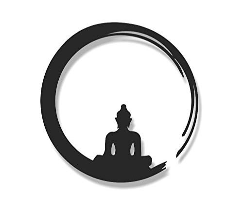

What is happiness? A plain simple three worded question. What is happiness, well when someone as articulated
and astute like you is asked such a question, you may reply with. “A sudden release of chemicals like serotonin,
oxytocin, and dopamine in the central nervous system causes a feeling to emerge in us that we commonly refer
to as happiness.”. Unless you are Sheldon or someone with serious issues, this won’t be your reply, and it would
be more along the lines of, “Simple when you are not in pain. You are happy.”

Simple indeed. Well, not really. Allow me to present you with a scenario.

If you have ever decided to go the gym and start working out or maybe even tried jogging, you would know how
excruciatingly painful it is. Every second of it, all the muscles present in your body are screaming for help,
screaming that you would stop. But you work through the pain, and you keep doing this daily. And eventually, you
start feeling more fit, feeling, if I dare say, happier. How is it then that despite being in pain, you were happy?
To which any keen individual would say. “You just formulated a scenario which goes according to your narrative. Pain
doesn’t only mean physical pain. It also means mental pain. Pressure, sadness, suffering. When you are rid of your
suffering, you are happy.”

A phenomenal point made, but if I dare infringe. I would like to present another scenario to you If you have ever
been around a newborn baby. It is pretty evident how hard it is to handle them and the amount of work they take
throughout the years. Crying in the middle of the night, causing a ruckus in ill-timed circumstances, taking away
any peace a young couple might have for the first few early years. Yet when the baby can walk and comes running to
his parent’s arm. The joy and happiness they feel, that’s something that takes away all the pain and suffering they
experienced throughout the years.

Frustrated and angry with my bland replies you might say, “Fine. why don’t you answer the question then,
what is happiness?”.

Oh, but I apologize my friend, for I may not be the perfect individual to answer this ‘simple’ question. But
throughout history, we have had many great people with much acumen in the subject matter. Let’s travel back to
ancient Greece and hear what our friend Epictetus has to say.

**“There is only one way to happiness and that is to cease worrying about things which are beyond the power of our will”**
. Stoicism, the school of thought led by Epictetus believed the only path to happiness was by accepting….
Shit happens. That there are things in the world that are beyond our control. Things that we will never have,
never achieve no matter how much we try to fight it, to resist. And by accepting things as they are, we can finally
achieve peace and lead a happy life.

As we are about to conclude our conversation, Nietzsche barges in and shouts, **_“Happiness is the feeling that power_**
**_increases - that resistance is being overcome.”_** He screams, fight, suffer, resist. He says don’t let go of your greed.
Be greedy. Let it be a guide. You are only jealous of things you want. Suffer and suffer gloriously to achieve your
goals. Only through pain and resisting can you accomplish all you want. **“The most spiritual men, as the strongest,**
**find their happiness where others would find their destruction: in the labyrinth, in hardness against themselves and**
**others, in experiments. Their joy is self-conquest: asceticism becomes in them nature, need, and instinct. Difficult**
**tasks are a privilege to them; to play with burdens that crush others, a recreation. Knowledge–a form of asceticism.**
**They are the most venerable kind of man: that does not preclude their being the most cheerful and the kindliest.”**. He
says if you have a why to live you can bear any how.

After hearing all this, you may say “wait…. What. So should I stop fighting, resisting, or shall I fight? Shall I resist?
what is it?”

Fortunately for me, I have another friend who will love to take up that question.

He says, accept. Accept both the facts that you are greedy and that there are things in life that you cannot have.
He says happiness and sadness are not two different things. But two different sides of the same coin. Accept both of
them. Neither is good nor bad. The buddhist monks believe we shall not run after anything nor try to fend of any emotion
we have. Accept them as they are, and that they are a part of you…..

“Oh god, stop. You still haven’t answered the original question. So what is happiness?”

To which, to no one’s surprise, one replies with. “The answer to what is happiness is the answer you choose to give.”
