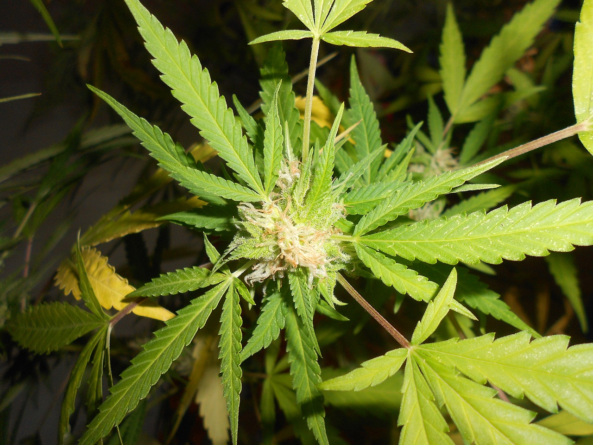
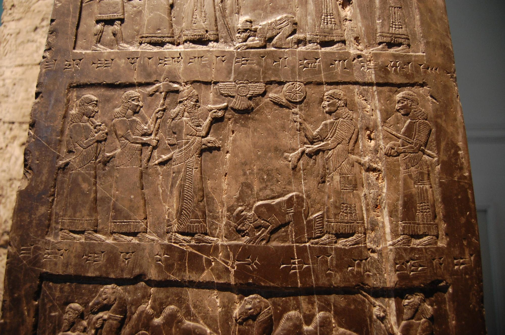
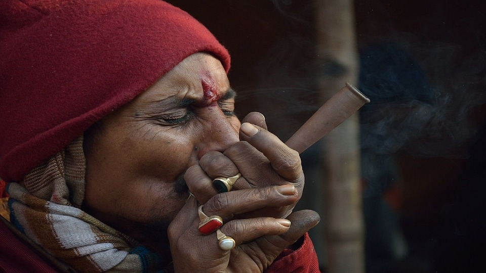

What do you think of when you hear Cannabis or, more precisely, "pot," "marijuana," "ganja"? A person with unkempt
hair, shabby clothes having a joint in hand and bong in another. As funny and sad as it seems, this was the image
portrayed of potheads all along in the media, and don't get me wrong, a vast majority of them sure fit the description
but mind you, the power of **"NUANCE."**

Recently a lot has stirred up in this conversation since many peer-reviewed and reputed journals have published
researches about the medical benefits of the plant and even some of its usefulness as a recreational substance.
Although classified as a schedule 1 drug ( substance with the highest potency of addiction), it's way less addictive,
lesser than cocaine, heroin, and even alcohol and tobacco. To understand how pot ended up in unchecked alleys and
unconstructed bridges, we have to take a deep dive into the history of bong and pot.

Zoooooooooop and we are back to 2000 BC. Archaeologists have found the use of hemp mainly in fiber and rope. Cannabis
was much more valuable as hemp fiber much before it was a recreational drug. An archeological site in the Oki Islands
near Japan contained cannabis achenes from about 8000 BC, probably signifying the use of the plant. Hemp use
archaeologically dates back to the Neolithic Age in China, with hemp fiber imprints found on Yang Shao culture
pottery dating from the 5th millennium BC. The Chinese later used hemp to make clothes, shoes, ropes, and an early
form of paper. Cannabis has been cultivated in Japan since the pre-Neolithic period for its fibers, food sources,
and possibly psychoactive materials. Not only this, but a vast majority of the population used it to enter **"higher"**
spiritual states and connect with the divine.

The plant has been associated with India's ritual, religious, social, and medical customs for thousands of years.
Marijuana is one of the five sacred plants suggested for freedom from anxiety in the Atharva Veda (circa 1400 BC),
an ancient Indian text on healing. In India, a much common form known to people was **"bhang"** **"chillum,"** as these were
consumed primarily as a form of worship/following of The Destructor, Lord Shiva. One of the few surviving books of the
Zend-Avesta, the ancient holy book of the Zoroastrians, Vendidad, translated as the **"Law Against Demons,"** calls bhang
a **"good narcotic"** that may allow some of the highest mysteries to be revealed. Although these are ancient accounts,
everyone should understand that very little knowledge of how these substances work was available, and an element of
the divine/magical energy was thought to be involved. It is still very unclear with various other psychedelics about
this particular involvement, but with Cannabis, it was much later understood that the drug wasn't a hallucinogen.

So if hemp was a means to connect with the divine, how come are my friends getting into federal court over having a
gram of it? Well, there, we need to get a little closer to the era of modern science. Since the 1500s, hemp has been
vastly cultivated for ropes, as I stated earlier. Still, this cultivation was much more organized, and production heavy
as plantation workers carried it out in various British colonies. Then during the 1800s, biologists began to notice how
it affected the consumer, and the first official government study of marijuana was carried out at Ohio State University.
Ohio State University did this study in 1860, and cataloged conditions that doctors had successfully treated with
marijuana, from **"bronchitis and rheumatism, to venereal disease and postpartum depression. The use of marijuana as**
**an analgesic was so common that medical textbooks and journals identified several types of pain for which it should**
**be administered".**

Then came the dark ages when industrialization, racism, and classism were about to take what's burnt and turn the
smoke towards the masses. A lot of current cultural inhibition of marijuana has to do with the 1900s and the war on
drugs which we will discuss in our next blog.

_Disclaimer: This article is solely written with the purpose of creating appropriate awareness about the Cannabis_
_plant and its derivatives. This article and the authors in no way endorse or encourage the use of Cannabis or any_
_other substances mentioned in places where legal issues might arise as well as in general without understanding its_
_effects and consulting an appropriate doctor._
