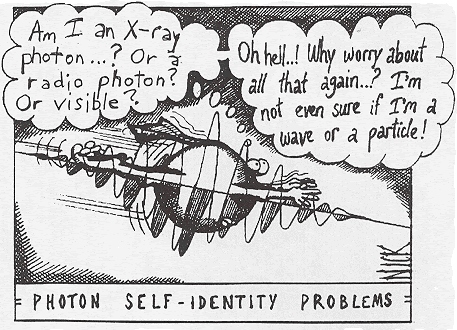
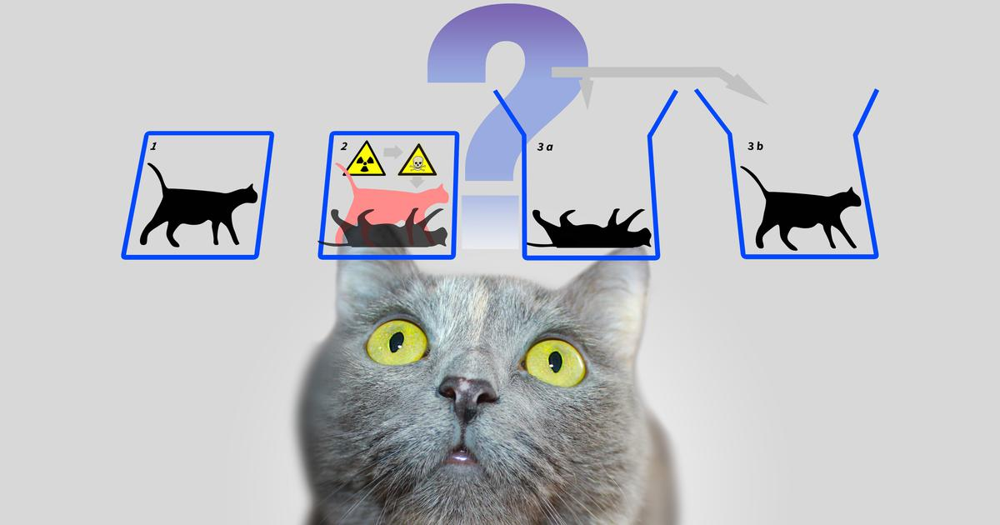
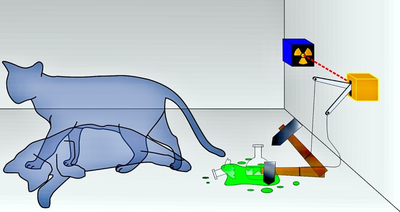

We believe that there is a certain type of truth associated with our experiences but what if we don’t have 
any experience?
What if no one has the experience of the truth? Would the truth still exist or will it cease to exist?
What is closer to “truth”, actual reality, or experience/observance? Can my experience, my narrative, and my perception 
alter reality?

Is observance or an experience the truth then? What would be the truth? What if we have the bitter privilege 
of choosing between truth and a higher truth?

Let’s get into the quantum world to try and make sense of this dilemma. As per the Copenhagen understanding of 
quantum mechanics, noticing an object makes it lose its quantum nature and breaks it down into the classical structure 
we're used to. This breakdown of the wave work suggests that the truth we see exists just when we are there to notice 
it. Also, an eyewitness doesn't just notice reality; they create it. Quantum physics demands that reality exists as 
waves, and wave-particle duality emerges because of our perception. Since we can't see the genuine wave nature of the 
real world, our perception decreases it to the inadequate reality we see.

Now, how can we talk about quantum physics without addressing the classic Schrodinger’s cat, right? Was it alive? Was 
it dead? Was it in both states? Or did we just create its reality? In reference to the Copenhagen interpretation, as 
soon as you open the box and make an observation, one of the probabilities becomes true and the other probability 
disappears. Let’s say the cat is alive, now the probability of ‘cat being alive’ is 100% and the other probability 
becomes 0%. This is the collapse of the wave function and it gives rise to the ever so loved and hated measurement 
problem. When Richard Feynman was asked about this problem, he said “JUST SHUT UP AND CALCULATE!” I think it couldn’t 
have been more accurate.

However, there is another explanation, “Many world interpretation” by Hugh Everett and it says that the observer is 
also basically a part of the quantum system so the wave function includes more than just the cat and includes an 
observer as well. Both worlds in which the cat is dead and alive exists, the observer simply ends up in one of them. 
So for what reason does the observer wind up in only one world while not on the other. To answer this, Everett says 
that the other version of you in the other universe is asking a similar question, you simply occur to ask this on the 
planet you wind up in. To accept this understanding, we need to acknowledge that endless universes exist all with their 
own results. The main issue with this is we never feel any impact of other forms of ourselves.

Does this not remind us of one of the Rick and Morty episodes?

Let’s look at a thought experiment that was done in regard to the Schrodinger’s cat,The Wigner’s Friend Experiment. 
To elaborate, Wigner puts a friend in a lab who performs the quantum measurement on a physical system, assuming the 
Quantum system to be the Schrodinger’s Cat. While the friend measures the system, he will get the outcome as a dead 
cat or alive cat. Wigner being on the outside of the system will be unaware of the state of the cat until he asks the 
friend about his measurement. Only after which the superposition state of the lab collapses. Now, since the measurement
had already been made by the Wigner’s friend and the physical system had already collapsed long ago Wigner knew about 
the outcome of the measurement, the friend’s point of view must be regarded as equally valid as Wigner’s and this is 
where the paradox comes into play. When really did this collapse occur? Was it when the friend had finished the 
measurement, or when Wigner’s consciousness was enlightened with the results?

As Bohr once quoted in “The Philosophical writings of Neil’s Bohr”,

“Everything that we call real is made up of things that cannot be regarded as real”. So for now, we cannot really make 
any claims about the nature of reality. We can only hope to understand things better and as Feynman said we might just 
need to “Shut up and calculate”.
