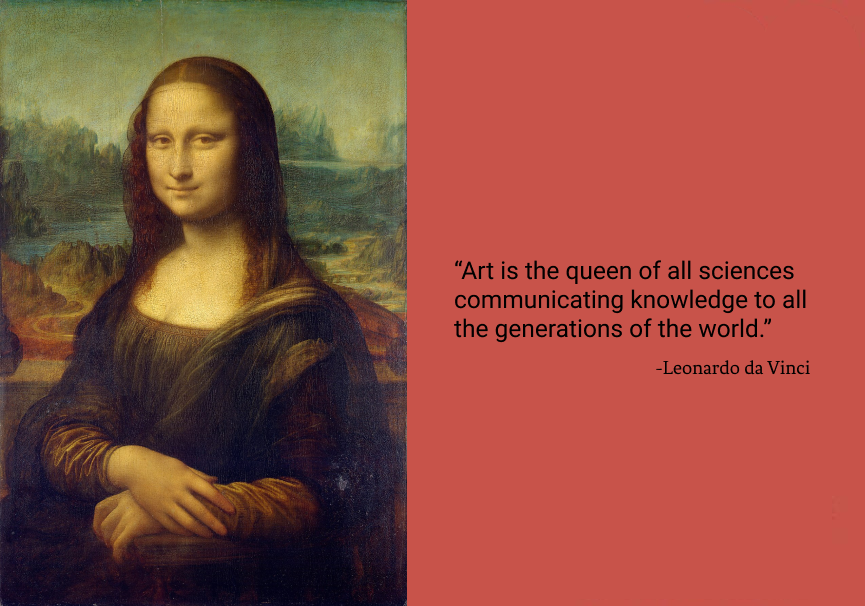
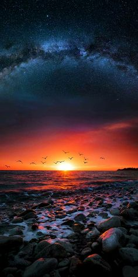
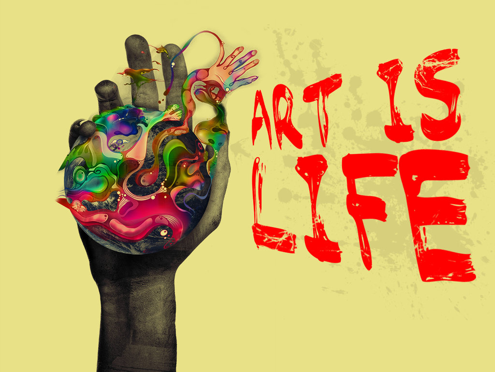

Have you ever wondered what this world would look like without paintings, melodies, museums, and galleries? And why 
are some art pieces so alluring and bewitching that you can't think about anything else at that moment? What's so 
captivating about them? Pause for a while and think about it. I'm pretty sure that all of us have already experienced 
art- in one way or the other at some point in our lives. But what is art? How will you define it? What's the first thing 
that comes to your mind when you hear the word "art"?

Leonardo da Vinci, a prevalent name in art and the creator of the well-known Mona Lisa painting, stated: "Art is the 
queen of all sciences communicating knowledge to all generations of the world." Paul Klee wrote in _The Inward Vision_, 
"Art does not reproduce the visible; rather, it makes visible." On the other hand, for Oscar Wilde, "Art is the most 
intense mode of individualism that the world has known." Well, my friends' art is all those and many more. These are 
just a few standard definitions of art and trust me, you'll find many more. But what's your own definition of art? 
How do you perceive it?

In my notion, the answers to these questions can be as different as the people on this planet. For some, art can be a 
painting, a song, a poem, a novel, a play, or a Spatio-temporal experiment. And some would say art is all about colors 
and beauty. It's as simple as that. But for some of us, art is the essence of life. Everything around us is artistic, 
for instance- the chirpings of birds, the sound of flowing water, rustles of leaves, mountains covered with snow, and 
the sky with millions and trillions of stars-even all that is art. In fact, guess what I wouldn't be surprised if 
someone would say we "Humans" are an art as well. So there is nothing as such a universal definition of art. It's 
open to your interpretation and totally depends on how you behold it.3

Art doesn't show us what to do precisely, yet a good piece of art can connect us to our mind, senses, and soul. 
There is something so fascinating about art; it not only conveys your experiences beyond space and time but can 
also transport you to an entirely new different place, firmly rooted in your imaginary minds when deeply touched. 
Through art, we instantly become aware of feelings that may not be unfamiliar to us, but maybe we did not actively 
focus on before. And that's like some sort of magic, right?!

As Dostoevsky wrote: "Art is as much needed for humanity as eating and drinking." And rightly so! The way our body needs 
food to function properly, likewise our soul needs art to stay alive. And one can’t explore-the various colors of life 
without art. The encounter with art- and with others over art- not only help us connect with ourselves but also expands 
our notion of "we" and allows us to interpret things from others point of view. Art has the power to make our lives 
richer by connecting us and our generations to come with more integrity, more concern, and more wholeheartedness. 

