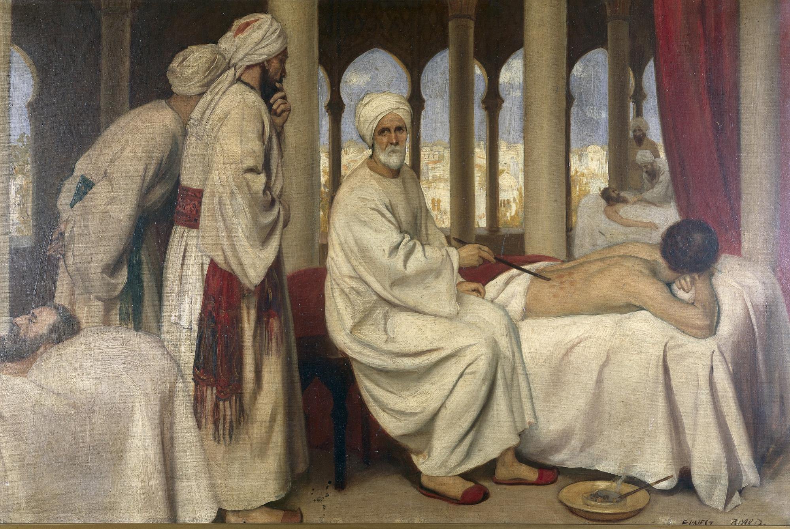

I told you I'd tell you more about how the cold War and War on drugs shaped the modern cannabis culture, but before 
that, let's charge our brain cells and recap a bit. Hemp, an essential byproduct of the marijuana plant, was being 
cultivated to make fibers in textile and ropes from the earliest civilization and was the main reason it got imported 
to various other continents and became a viable crop across the globe. It prevailed through different religions and 
other cultures as a means to heal and experience divinity. But we didn't talk about it last time because it was being 
used as a psychoactive drug for a long time and had restrictions. One of the first restrictions on Marijuana was imposed 
by Islamic countries as Sufis used it to have religious ceremonies and as a medium to interact with "Allah." At that 
time, Sufism wasn't appreciated in the mainstream. Major Islamic rulers were Sunni elites and wanted to appease the 
majority of the Sunni population; thus, countries like Egypt imposed heavy restrictions on the cultivation and usage 
of the plant.

Hashish, the most common form of recreational consumption of Cannabis, started to get heat and spread throughout the 
world when hemp seeds got carried with cross-continent slave trades. An essential element in restricting the consumption 
of a recreational substance was the fear of social fallout and, more importantly, classism and racism. The discovery of 
Hashish may not have been seen as a breakthrough at the time, but it had a significant effect on European culture and 
literary thought. Before the French campaign in Egypt, Hashish wasn't well known in Europe and certainly wasn't 
commonly used.

When Napoleon's army invaded Egypt, it was a conservative Muslim state, and thus alcohol wasn't even thought of as 
a delicacy. So now there is an army of 40000 French soldiers with empty wine crates, and that is the point they 
are introduced to Hashish as a form of relaxing substance. This was a critical moment in history as it was the 
time cannabis as a recreational drug got popular in Europe. Although it wasn't much new as smoking was introduced 
here when Columbus returned from his voyage to the new world and told Europeans about tobacco, Marijuana still had 
a lot of social prejudice as a drug of slaves or lowly. Elites tried to widen the classist gap by reinforcing this 
as a firm belief in later ages.

After Napoleon went back to France, the general he had left in charge of Egypt, General Jacques-François Menou, was 
a noble-born French revolutionary who married into an upper-class Sunni family after taking command of Egypt. For 
Menou, the prospect of a hashish ban killed two birds with one stone: It would appease the Sunni elite by cracking 
down on Sufis and alleviate a perceived public health problem among the French troops. The ordre du jour banning the 
cultivation, sale, and consumption of Cannabis, considered by some scholars to be the first drug prohibition law in 
the modern era, came down in 1800. It opens with the following:

>Article One: The use of strong liquor, made by certain Muslims with a particular grass(herbe) called Hashish, 
>and smoking of the seed of Cannabis, is prohibited throughout Egypt. Those accustomed to drinking this liquor 
>and smoking this seed lose reason and fall into a violent delirium, often leading them to commit excesses of 
>all kinds.

Whether or not Menou's order was the first modern penal law on drugs, it largely failed to work (a fact that should 
come as no surprise to us in the 21st century). Hashish continued to be produced, sold, and consumed widely throughout 
Egypt, and it came home with French troops when they left Egypt in 1801. It wasn't long before Hashish was commonly 
used in France and the rest of western Europe. This was the era of romanticism, and many of the great artists, authors, 
poets, etc., were brought together because of Cannabis calling themselves Le Club des Hachichins (Hashish-Eaters' Club). 
Luminaries such as Théophile Gautier, Charles Baudelaire, Gérard de Nerval, Victor Hugo, Honoré de Balzac, and Alexandre 
Dumas would meet in Paris to take hashish and exchange notes on their experiences. They rejected mainstream attempts to 
associate Hashish with what was regarded as Oriental barbarism and, through their writings, normalized marijuana use and 
popularized the Romantic era's bohemian creed: l'art pour l'art (art for art's sake).

Similarly, in India, when the British took over, they too overlooked the hoard of benefits the plant had even at that 
time and were scared of it, causing a social menace. They too wanted to impose a total ban on cultivation and possession 
of the plant and its derivatives but the British parliament, short on money, decided to gather revenue from widespread 
Marijuana farming by taxing it in 1790 and 3 years later established a regulatory framework to regulate its sale and 
production via issuing licenses to farmers and sellers.

Temperance movement advocates persisted, however, driven by the evils of opium use associated with Cannabis. Parliament 
responded by commissioning the most comprehensive government study of Marijuana in human history. The seven-volume 
3,500-page "Report of the Indian Hemp Drugs Commission" of 1894 to 1895 called over a thousand witnesses from around 
the world. The findings emphatically rejected the alleged grounds for prohibition. The commission found (as its 
predecessors did) that marijuana cultivation is nearly impossible to eradicate and argued that it produces no "evil 
results" in the first place:

>Total prohibition of the cultivation of the hemp plant for narcotics, and the manufacture, sale, or use of the drugs 
>derived from it, is neither necessary nor reasonable in consideration of their ascertained effects, of the prevalence 
>of the habit of using them, of the social and religious feeling on the subject, and of the possibility of its driving 
>the consumers to have recourse to other stimulants or narcotics which may be more deleterious.

The commission went on to recommend a tax-and-license scheme for the marijuana farming industry. The idea was to have 
supervision via licenses issued by the government for cultivation and supply. Still, parliament ignored it as the 
significant farming of weed brought much-needed revenue for the British government. Eventually, in the 20th-century, 
prohibition culture took over, and all governments overlooked many benefits of the plant only to realize the mistake 
much later in the 21st century.

The particular trend in all of the above prohibitionist movements was clear. It was always the ruling class prohibiting 
the commoners from the culture of Marijuana and its benefits in fear of the tremendous potential to cause revolutionary 
change in the mindset of people consuming it and whole populations. Higher power forces couldn't take risks in allowing 
the plant to impact that much. Though not all treated it the same way as we saw in the above examples where the British 
left the supply and demand unchecked due to the industry's size and revenue, while in the middle east, harsh bans and 
regulations were in place. One last and exciting example to note from this brief history about Marijuana is the 
Bashilange tribe. They were the ruthless warriors of the eastern region of Congo in the 19th century, known to devour 
and eat their enemies and enslave their prisoners. They were the most feared in the whole of eastern Congo. But when 
the governor-general of East Africa discovered these lands, he observed a remarkable change in their culture since 
they had found Marijuana. The new lot of the tribe called themselves "Sons of Cannabis," peace-loving, non-cannibalistic 
people who enjoyed the pleasures of sex much more than ever. They had become one of the most peaceful tribes of that 
area, who formerly were human devouring beings that established a powerful social order. Thus their tranquil nature 
cost them as other tribes started to refuse tribute payments, and eventually, the tribe splintered. Once again ruled 
by the ruthless and fearsome fighters, it tried to gain its glory back.

All these various historical accounts give us a clear view of how much the plant had influenced cultures and regimes 
throughout history, and yet the worst was to come in the future. One thing that can't is what I had stated at the start 
of this series - "Nuance." Weed/Marijuana/Cannabis isn't just a plant to roll up a fat one and get high on, and there 
is a lot of context we forget to understand individually and culturally. As the people choosing those in power, we 
should understand not all those policies that are pulled up would benefit us eventually. One needs to grow above the 
little gimmicks to see what's behind the curtain. Next time we'll see how the War on drugs came to being and its 
implications across the globe.

_Disclaimer: This article is solely written with the purpose of creating appropriate awareness and valid and correct_
_information spread around the Cannabis plant and its derivatives. This article and the authors in no way endorse or_
_encourage the use of Cannabis or any other substances mentioned in places where legal issues might arise and in general_
_without understanding its effects and consulting an appropriate doctor._
